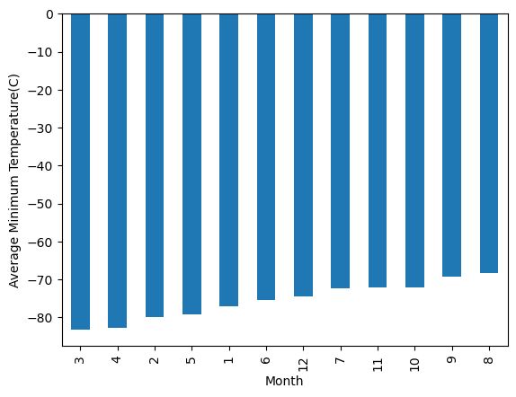
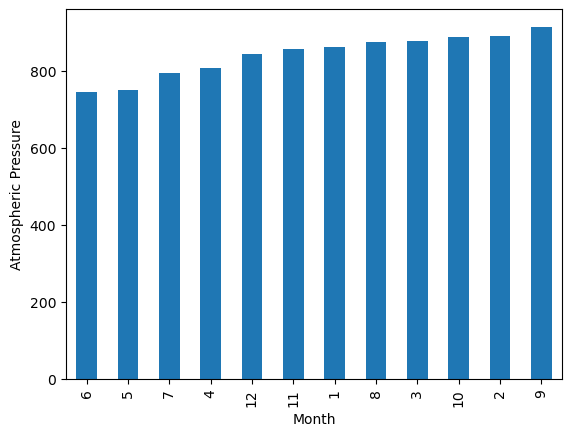
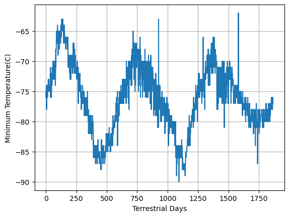

# RedPlanetCrawler
## UNC Data Analytics Bootcamp Challenge 11

This assignment consists of two technical products.
- Deliverable 1: Scrape titles and preview text from Mars news articles.
- Deliverable 2: Scrape and analyze Mars weather data, which exists in a table.

## Part 1: Mars News Scraping

This Jupyter Notebook is dedicated to the process of scraping and extracting titles and preview text from the Mars news site. The aim is to provide a comprehensive guide on how to use web scraping techniques to gather valuable information from a webpage. The main tools employed in this notebook are Splinter for automated browsing and BeautifulSoup for extracting text elements.

**The notebook consists of several crucial steps:**

- Visiting the Website: The initial step involves utilizing automated browsing through Splinter to access the Mars news site. This visit is important for identifying the specific HTML elements to be scraped.

- Scraping the Website: The second step is about the creation of a BeautifulSoup object. This object is then employed to extract text elements from the webpage, which correspond to the news articles.

- Storing the Results: The extracted titles and preview text are organized into a Python data structure. Each news article's title and preview text are stored in a dictionary with two keys: title and preview. All these dictionaries are further stored in a list to facilitate handling and printing.

- Exporting the Data: At the end of the notebook, the extracted data was exported into a JSON file named "news_output.json". This step ensures that the scraped information is preserved and accessible for future analysis or sharing.

## Part 2 : Mars Weather Data Analysis Readme

This Jupyter Notebook focuses on scraping and analyzing Mars weather data from a specified website. The notebook employs libraries like splinter and BeautifulSoup for web scraping, and matplotlib and pandas for data analysis and visualization. The ultimate goal is to gain insights into Mars' climate patterns using the available temperature and atmospheric pressure data.

**The notebook is divided into several steps:**

- Visiting the Website: Automated browsing is utilized to access the Mars Temperature Data Site and identify elements for scraping.

- Scraping the Table: The web page's HTML content is parsed using Beautiful Soup, and the data is extracted from the HTML table containing temperature and pressure information.

- Storing the Data: The scraped data is organized into a Pandas DataFrame with appropriate column headings. This DataFrame is structured to hold details such as id, terrestrial_date, sol, ls, month, min_temp, and pressure.

- Preparing Data for Analysis: The data types of DataFrame columns are examined and converted as needed using Pandas methods such as astype and to_datetime.

- Analyzing the Data: The dataset is subjected to various analyses using Pandas functions and visualizations using Matplotlib.

- Saving the Data: The final processed DataFrame is saved as a CSV file named 'mars_df.csv' for further reference.

### **During the analysis process, The following key questions are addressed:**

- Number of Months: The number of months on Mars is determined, indicating the variety in the data.

- Martian Days' Worth of Data: The quantity of Martian days' worth of data available is computed, providing an understanding of the temporal coverage of the dataset.

- Coldest and Warmest Months: The coldest and warmest months on Mars are identified. This is achieved by calculating the average minimum daily temperature for all months and visualizing the results as a bar chart.

- Atmospheric Pressure Variation: The months with the lowest and highest atmospheric pressure on Mars are determined. The average daily atmospheric pressure for each month is calculated and presented through visualizations.

- Terrestrial Days in a Martian Year: The approximate number of terrestrial (Earth) days in a Martian year is estimated using temperature data. By observing the plotted daily minimum temperatures, an estimation of a Martian year's length is made.

## Findings:

1. The analysis revealed that Mars experiences 12 months, much like Earth, with each month showing distinct temperature and atmospheric pressure patterns.

2. The dataset comprises data from 1867 Martian days, indicating a relatively extensive coverage.

3. The third month is, on average, the coldest month on Mars, while the eighth month is the warmest. It's important to note that Mars remains very cold in human terms regardless of the month.

4. The atmospheric pressure varies throughout the Martian year. On average, the sixth month experiences the lowest atmospheric pressure, while the ninth month has the highest.

5. An estimated Martian year consists of roughly 675 Earth days, based on the observed temperature patterns.

In conclusion, this notebook showcases the process of scraping, organizing, analyzing, and visualizing Mars weather data. The results provide insights into Mars' climate patterns, highlighting the variation in temperatures and atmospheric pressures across different months.

## Source Code:
- python BeautifulSoup parsing table <https://stackoverflow.com/questions/23377533/python-beautifulsoup-parsing-table>
- pandas documentation <https://pandas.pydata.org/docs/>
- Change Data Type for one or more columns in Pandas Dataframe <https://www.geeksforgeeks.org/change-data-type-for-one-or-more-columns-in-pandas-dataframe/>
- Matplotlib 3.7.2 documentation <https://matplotlib.org/stable/index.html>
- JSON encoder and decoder <https://docs.python.org/3/library/json.html>

## References:
[The Mars News](https://static.bc-edx.com/data/web/mars_news/index.html) is operated by edX Boot Camps LLC for educational purposes only. The news article titles, summaries, dates, and images were scraped from [NASA's Mars News](https://mars.nasa.gov/) website in November 2022. Images are used according to the [JPL Image Use Policy](https://www.jpl.nasa.gov/jpl-image-use-policy) courtesy NASA/JPL-Caltech.
